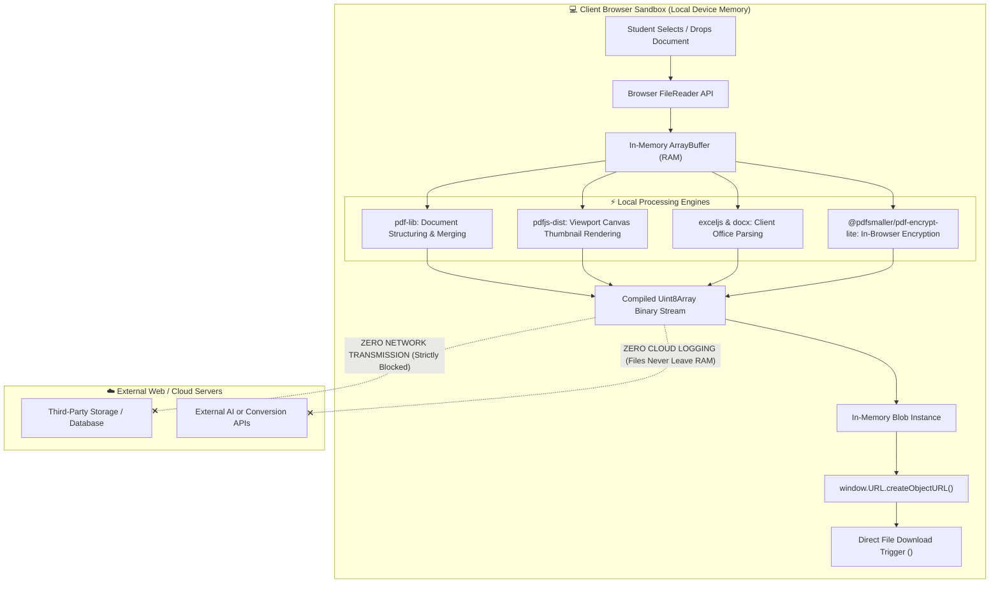
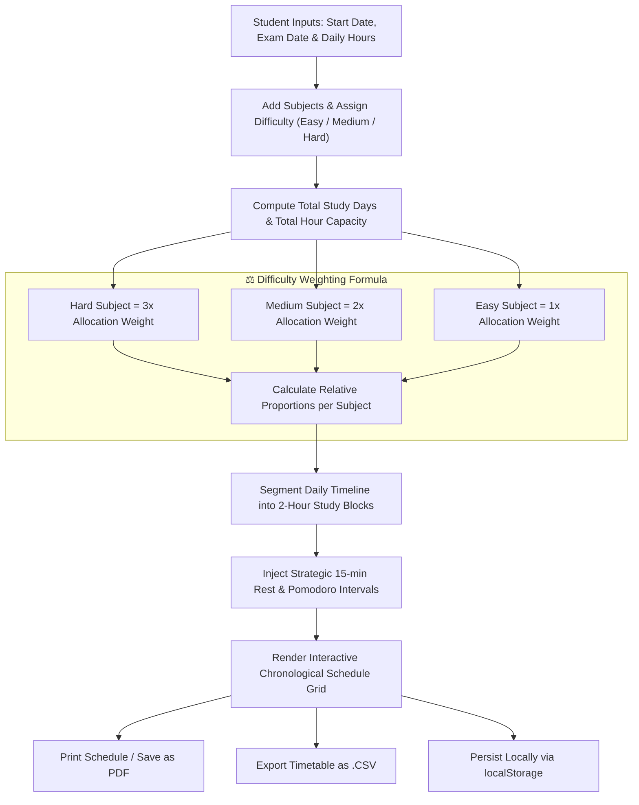
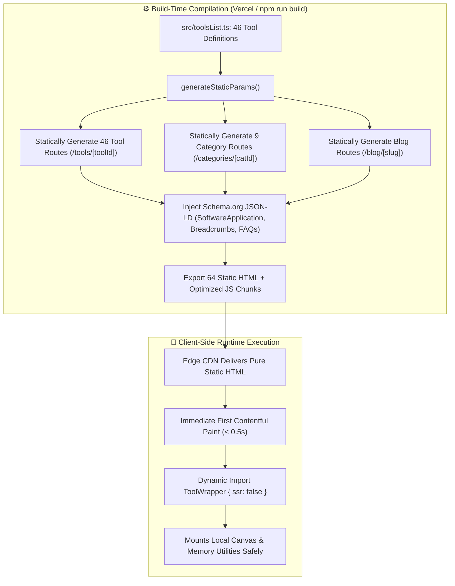

# Student Tools 📚⚡

**100% free, privacy-first, client-side academic utility platform for PDF manipulation, study planning, and student calculators.**

Student Tools empowers students, researchers, and educators with 46+ powerful utilities that process documents, calculations, and study schedules entirely within the browser—guaranteeing zero server uploads and total academic data privacy.

> **PRIVACY-FIRST → ZERO SERVER UPLOADS → CLIENT-SIDE ENGINES → 100% FREE → OFFLINE-READY**

[](https://github.com/adarsh0044321/student-tools/releases)
[](https://student-tools-seven.vercel.app/)
[-black.svg)](https://nextjs.org/)
[](https://react.dev/)
[](https://www.typescriptlang.org/)
[](https://vercel.com/)
[](LICENSE)

---

## 📦 Direct Access & Live Deployment

Student Tools is continuously deployed on Vercel with automated static optimization and edge caching:

| Service | Target Audience | Access Mode | Live URL |
| :--- | :--- | :--- | :--- |
| **Student Tools Web Platform** | Students, Researchers & Educators | Client-Side In-Browser (Zero Cloud Storage) | [🌐 Launch Student Tools (Live Production)](https://student-tools-seven.vercel.app/) |
| **All-in-One Utility Suite** | Assignments, Lab Reports & Books | 46 Client-Side PDF & Calculation Engines | [🚀 Explore All 46 Tools](https://student-tools-seven.vercel.app/#tools-section) |
| **Academic Blog & Guides** | University Study Workflows | Pre-Rendered Guides & PDF Tips | [📖 Read Study Blog](https://student-tools-seven.vercel.app/blog) |

*The complete source code and release verification logs are available on the [Official GitHub Repository](https://github.com/adarsh0044321/student-tools).*

---

## 📌 Overview & Problem Statement

University students, academic scholars, and educators routinely struggle with fragmented document utilities:
* **Academic Privacy & Leak Concerns**: Commercial online PDF services upload essays, research drafts, letters of recommendation, and confidential grade sheets to remote third-party cloud servers where file storage and data retention policies remain ambiguous.
* **Aggressive Paywalls & Hourly Quotas**: Popular PDF converter platforms cap free users at 1–2 documents per day or enforce subscription barriers right before strict assignment deadlines.
* **Sluggish Broadband & Cloud Roundtrips**: Uploading 50MB+ scanned textbook packages or lab slide handouts over congested campus Wi-Fi networks causes frequent timeouts and wasted study hours.
* **Scattered Productivity Tooling**: Students are forced to manage separate browser tabs for PDF merging, CGPA/GPA calculations, assignment countdowns, Pomodoro timers, and revision timetable scheduling.

**Student Tools** replaces this fragmented landscape with a unified, browser-powered academic workstation. By executing all document parsing, rendering, encryption, office conversions, and calculations directly in client-side Web Workers and JavaScript engines, files never leave the student's personal computer or phone.

---

## 📸 Application Interface & Feature Tour

The platform is structured into three foundational utility pillars engineered specifically for student workflows:

### 📑 1. PDF Manipulation, Office Conversion & Security Suite
* **Comprehensive Document Toolkit**: 32 dedicated document utilities spanning page organization, compression, OCR text extraction, office conversions (`.docx`, `.xlsx`, `.pptx`), document rotation, page numbering, stamping, watermarking, password encryption, and digital signing.
* **Visual In-Browser Previews**: Built-in canvas viewport rendering via `pdfjs-dist` allows students to visually inspect thumbnails, rearrange page sequences, and rotate individual slides prior to compilation.
* **Zero Cloud Transfer**: Files are parsed directly into typed array buffers (`Uint8Array`) in local device memory, eliminating server roundtrips and keeping confidential research private.

### 🧮 2. Academic Grade, Attendance & Formula Calculators
* **Precision Grade Calculators**: Calculate multi-semester Cumulative Grade Point Averages (CGPA), semester GPA, weighted course marks, and instant GPA-to-Percentage conversions across diverse university grading scales (4.0, 10.0, and percentage-based systems).
* **Attendance Requirement Tracker**: Determine current attendance percentages and calculate the exact number of future lectures required to satisfy mandatory institutional attendance thresholds (e.g. 75% or 80%).
* **Scientific & Conversion Tools**: Client-side scientific calculator and universal physical unit converter for lab homework, engineering problem sets, and physics coursework.

### 🎯 3. Study Productivity, Revision Scheduler & Active Recall Flashcards
* **Difficulty-Weighted Study Planner**: Generates chronological daily revision timetables leading up to final exams. Automatically weighs challenging courses (Hard: 3x, Medium: 2x, Easy: 1x time slots) with integrated break intervals, timetable printing, and CSV export.
* **Active Recall Flashcard Quizzer**: Full flashcard study deck engine with 3D card flip animations, self-assessment scoring, and dynamic Multiple Choice Question (MCQ) quiz modes with local browser storage.
* **Focus & Exam Timers**: Customizable Pomodoro study interval timers with audio alerts and assignment due-date countdown clocks.

---

## 🔄 Detailed Operational Flowcharts

### 1. Zero-Cloud Client-Side Document Processing Architecture
The following diagram illustrates how student files are loaded, parsed, transformed, and downloaded entirely inside the local browser sandbox without touching external servers:



---

### 2. Difficulty-Weighted Revision Planner Algorithm
How the Study Planner calculates, weights, and compiles personalized exam schedules:



---

### 3. Next.js App Router Architecture & Static Pre-Rendering (SSG)
How Next.js pre-compiles all 46 tools at build time to provide near-instant page loads and comprehensive Schema.org SEO:



---

## 🏗️ Core Modules & Architectural Features

### 📑 1. Client-Side PDF Engine (`src/tools/`)
- **Multi-Document Assembly**: Merges unlimited PDF files in memory using `pdf-lib`, preserving vector lines, form fields, and embedded typography.
- **Page Extraction & Pruning**: Splits multi-page textbooks, extracts specific page intervals (e.g. `1-4, 8, 12-15`), or isolates single homework problem sheets.
- **Visual Canvas Previews**: Uses `pdfjs-dist` to render thumbnails into HTML5 `<canvas>` elements, enabling visual drag-and-drop page sorting and individual 90° rotations before final compilation.
- **Document Protection & Encryption**: Client-side AES encryption and password protection using `@pdfsmaller/pdf-encrypt-lite` without transmitting passphrases over network connections.

### 🧮 2. Academic Grade Suite (`src/components/calculators/`)
- **CGPA / GPA Engine**: Supports customizable course credits, grade point values, and multi-semester aggregations.
- **Attendance Compliance Matrix**: Calculates lecture counts needed to reach 75% or 80% mandatory attendance requirements.
- **Unit & Math Converters**: Instant evaluation of arithmetic, trigonometric, and scientific equations alongside physical unit translations (length, temperature, digital storage, mass).

### 📅 3. Difficulty-Weighted Revision Scheduler (`StudyPlanner.tsx`)
- **Proportional Study Distribution**: Prevents cramming by weighting courses according to syllabus complexity. Hard subjects receive 3x more dedicated 2-hour review slots.
- **CSV & Print Export**: Compiles study dates, target topics, session durations, and break reminders into clean printable styles and downloadable CSV spreadsheets.

### 🧠 4. Active Recall Flashcard Quizzer (`FlashcardsQuizzer.tsx`)
- **3D Card Flip Animation**: Smooth CSS card flips for self-testing definitions, vocabulary, and formulas.
- **Automated Quiz Generator**: Dynamically generates 4-choice Multiple Choice Questions (MCQ) by selecting correct definitions and generating plausible distractors from companion cards in the active deck.
- **Pre-Loaded Study Decks**: Ships with ready-to-study decks for Computer Science, Biology, and Medical Terminology with support for custom JSON deck import/export.

### ⚡ 5. Next.js App Router & Programmatic SEO (`app/`)
- **Static Site Generation (SSG)**: 64 static routes pre-rendered at compile time for maximum speed and zero server latency.
- **Structured Data (Schema.org)**: Automated injection of `SoftwareApplication`, `SearchAction`, `BreadcrumbList`, and `FAQPage` JSON-LD schemas.
- **Dynamic Meta Tags & Sitemaps**: Programmatic `sitemap.xml` and `robots.txt` generation ensuring high search engine visibility for student queries.

### 🎨 6. WCAG AA Accessible Design (`src/index.css`)
- **Calibrated Color Contrast**: Primary red (`#d32f2f`) and orange (`#bf360c`) design tokens tested to deliver contrast ratios exceeding **5.64:1** against white text (surpassing the WCAG AA 4.5:1 minimum standard).
- **Keyboard Navigation Focus States**: Global `:focus-visible` styling (`outline: 3px solid #ff6a00`) across all interactive cards, radio buttons, and inputs.
- **Mobile Touch Target Scaling**: Responsive media queries enforcing `min-height: 44px` and comfortable padding across mobile viewports.

---

## 🛠️ Complete Tools Directory & Capability Catalog

Student Tools includes 46 fully functional utilities categorised across academic and document workflows:

| Category | Tool Name | Tool ID | Underlying Engine | Client-Side Capability |
| :--- | :--- | :--- | :--- | :--- |
| **Organize** | **Merge PDF** | `merge` | `pdf-lib` | Combines multiple lecture slides, notes, or research papers into one document |
| **Organize** | **Split PDF** | `split` | `pdf-lib` | Splits documents by custom page ranges or extracts all pages into a ZIP |
| **Organize** | **Remove Pages** | `remove-pages` | `pdf-lib` | Deletes blank pages, cover sheets, or skipped units |
| **Organize** | **Extract Pages** | `extract-pages` | `pdf-lib` | Isolates specific pages or worksheets into a new PDF |
| **Organize** | **Organize PDF** | `organize` | `pdfjs-dist` + `pdf-lib` | Visual grid interface to rearrange, reorder, and delete individual pages |
| **Organize** | **Scan to PDF** | `scan-to-pdf` | HTML5 Canvas + `pdf-lib` | Converts device camera photos and scans into clean PDF documents |
| **Optimize** | **Compress PDF** | `compress` | `pdf-lib` | Reduces file size for email submissions and course portal limits |
| **Optimize** | **Repair PDF** | `repair` | `pdf-lib` | Reconstructs corrupt or unreadable PDF document structures |
| **Optimize** | **OCR PDF** | `ocr` | `pdfjs-dist` | Extracts plain text from scanned document pages for revision notes |
| **Convert To** | **JPG to PDF** | `jpg-to-pdf` | HTML5 Canvas + `pdf-lib` | Compiles image collections into portrait or landscape formatted PDFs |
| **Convert To** | **Word to PDF** | `word-to-pdf` | `mammoth` + `pdf-lib` | Converts `.docx` documents to standard PDF layout |
| **Convert To** | **Excel to PDF** | `excel-to-pdf` | `xlsx` + `pdf-lib` | Renders `.xlsx` spreadsheet sheets into printable PDF tables |
| **Convert To** | **PowerPoint to PDF** | `powerpoint-to-pdf` | `jszip` + `pdf-lib` | Converts `.pptx` presentation slides to PDF handouts |
| **Convert To** | **HTML to PDF** | `html-to-pdf` | HTML5 DOM + Canvas | Converts raw HTML code or text files into formatted PDF documents |
| **Convert From**| **PDF to JPG** | `pdf-to-jpg` | `pdfjs-dist` + `jszip` | Renders PDF pages into high-resolution JPG images packaged in a ZIP |
| **Convert From**| **PDF to Word** | `pdf-to-word` | `docx` + `pdfjs-dist` | Converts PDF text and sections into editable `.docx` files |
| **Convert From**| **PDF to Excel** | `pdf-to-excel` | `exceljs` + `pdfjs-dist` | Extracts tabular data from PDFs into editable `.xlsx` workbooks |
| **Convert From**| **PDF to PowerPoint** | `pdf-to-powerpoint`| `jszip` + `pdfjs-dist` | Exports presentation slides from PDF documents |
| **Convert From**| **PDF to PDF/A** | `pdf-to-pdfa` | `pdf-lib` | Formats documents for standardized long-term academic archiving |
| **Edit PDF** | **Rotate PDF** | `rotate` | `pdf-lib` | Rotates individual or all pages by 90°, 180°, or 270° |
| **Edit PDF** | **Add Page Numbers** | `page-numbers` | `pdf-lib` | Stamps custom page numbers with customizable placement and format |
| **Edit PDF** | **Watermark PDF** | `watermark` | `pdf-lib` | Applies custom text watermarks with adjustable opacity and position |
| **Edit PDF** | **Crop PDF** | `crop` | `pdf-lib` | Trims document margins and removes unnecessary whitespace |
| **Edit PDF** | **Edit PDF** | `edit-pdf` | `pdf-lib` | Adds text annotations, comments, and marks to assignments |
| **Edit PDF** | **Fill PDF Forms** | `pdf-forms` | `pdf-lib` | Types and embeds data into PDF form text fields |
| **Security** | **Protect PDF** | `protect` | `@pdfsmaller/pdf-encrypt-lite` | Encrypts PDF documents with secure user passwords |
| **Security** | **Unlock PDF** | `unlock` | `pdf-lib` | Removes password restrictions from encrypted PDFs |
| **Security** | **Sign PDF** | `sign` | HTML5 Canvas + `pdf-lib` | Draw, sign, and stamp signatures onto official documents |
| **Security** | **Redact PDF** | `redact` | `pdf-lib` | Blackouts sensitive personal details, grades, or private IDs |
| **Security** | **Compare PDF** | `compare` | `pdfjs-dist` | Compares two PDFs side-by-side to detect text and revision differences |
| **Intelligence** | **AI Summarizer** | `ai-summarizer` | Client NLP Tokenizer | Generates structured Markdown bullet-point summaries of reading materials |
| **Intelligence** | **Translate PDF** | `translate` | Client Text Engine | Translates extracted text passages into multiple target languages |
| **Student Suite** | **CGPA Calculator** | `cgpa-calculator` | React Engine | Multi-semester GPA/CGPA calculator with customizable credit weights |
| **Student Suite** | **Attendance Calculator** | `attendance-calculator`| React Engine | Tracks attendance percentages and calculates required future classes |
| **Student Suite** | **Percentage Calculator**| `percentage-calculator`| React Engine | Calculates marks percentages, growth, and score differences |
| **Student Suite** | **Marks Calculator** | `marks-calculator` | React Engine | Aggregates theory, practical, and internal assessment marks |
| **Student Suite** | **Grade Calculator** | `grade-calculator` | React Engine | Predicts required final exam grades to achieve target course marks |
| **Student Suite** | **GPA to Percentage** | `gpa-to-percentage`| React Engine | Converts GPA scores across 10-point, 4-point, and percentage scales |
| **Student Suite** | **Unit Converter** | `unit-converter` | React Engine | Lab unit conversions (length, mass, temperature, digital units) |
| **Student Suite** | **Scientific Calculator**| `scientific-calculator`| React Engine | In-browser scientific calculator with trigonometric and log functions |
| **Student Suite** | **Age Calculator** | `age-calculator` | React Engine | Calculates exact age in years, months, and days for exam forms |
| **Productivity** | **Study Planner** | `study-planner` | Scheduling Algorithm | Generates difficulty-weighted daily revision timetables with CSV export |
| **Productivity** | **Flashcard Quizzer** | `flashcards` | Interactive Quiz Engine | Active recall 3D flashcards, score-based MCQ quizzes, and JSON storage |
| **Productivity** | **Pomodoro Timer** | `pomodoro-timer` | Web Audio API | Focus timer intervals (25m study / 5m break) with auditory alerts |
| **Productivity** | **Word Counter** | `word-counter` | Regex Tokenizer | Real-time word, character, sentence, and reading-time counter for essays |
| **Productivity** | **Exam Countdown** | `exam-countdown` | Date Interval Engine | Live countdown clocks for final exams, project deadlines, and tests |

---

## 💻 Technology Stack Reference

| Layer | Technology | Purpose |
| :--- | :--- | :--- |
| **Frontend Framework** | **Next.js 14.2.35 (App Router)** | Static site pre-rendering (SSG), dynamic path routing, and programmatic SEO |
| **UI Library** | **React 18.3.1** | Component architecture, responsive client-side state management |
| **Type Safety** | **TypeScript 5.5.3** | Strict compile-time typing for tool definitions, file interfaces, and payloads |
| **Styling & Theme** | **Modern CSS3 Design Tokens** | WCAG AA compliant contrast colors, focus-visible states, responsive layout |
| **PDF Manipulation** | **pdf-lib (v1.17.1)** | Client-side creation, merging, splitting, watermarking, and modifying of PDFs |
| **PDF Rendering & OCR**| **pdfjs-dist (v4.0.379)** | In-browser canvas rendering, page thumbnail generation, and text extraction |
| **Office File Handlers**| **docx (v9.7)**, **exceljs (v4.4)**, **xlsx**, **mammoth** | Reading, compiling, and converting Word documents and Excel sheets in-browser |
| **File Compression** | **jszip (v3.10.1)** | Multi-page image and split PDF archiving for instant bundle downloads |
| **Encryption** | **@pdfsmaller/pdf-encrypt-lite** | Fast, lightweight client-side AES document encryption and password locks |
| **Icons & Visuals** | **lucide-react (v0.444.0)** | Clean, accessible SVG iconography mapped dynamically across all utilities |
| **Hosting & Edge CDN** | **Vercel** | Serverless static hosting, continuous deployment, and global edge caching |

---

## 📂 Verified Project Structure

```text
student-tools/
├── app/                              # Next.js App Router
│   ├── blog/                         # Academic study blog system
│   │   ├── [slug]/                   # Dynamic blog post viewer
│   │   │   └── page.tsx              # Pre-rendered static article page
│   │   └── page.tsx                  # Blog listing overview
│   ├── categories/                   # Category filtering paths
│   │   └── [categoryId]/             # Tool category route
│   │       └── page.tsx              # Category-specific tools grid
│   ├── tools/                        # Dynamic path-based routing for all 46 tools
│   │   └── [toolId]/                 # generateStaticParams() pre-renders all 46 tools
│   │       └── page.tsx              # Mounts ToolWrapper with SSR disabled
│   ├── layout.tsx                    # Root HTML layout, font declarations & analytics
│   ├── page.tsx                      # Main dashboard landing with Hero CTAs & search grid
│   ├── robots.ts                     # Programmatic robots.txt configuration
│   └── sitemap.ts                    # Programmatic sitemap.xml generator (all 64 routes)
├── public/                           # Static assets
│   ├── favicon.svg                   # Vector brand favicon
│   ├── icons.svg                     # Fallback SVG symbol sheet
│   └── logo.png                      # Circular brand logo icon
├── src/                              # Core application source
│   ├── components/                   # UI components and layout wrappers
│   │   ├── calculators/              # Interactive student widgets
│   │   │   ├── AgeCalculator.tsx     # Exam registration age calculator
│   │   │   ├── AttendanceCalculator.tsx # Minimum attendance requirement tracker
│   │   │   ├── CGPACalculator.tsx    # Multi-semester CGPA/GPA calculator
│   │   │   ├── ExamCountdown.tsx     # Assignment and exam deadline countdown
│   │   │   ├── FlashcardsQuizzer.tsx # 3D active recall flashcards & MCQ quiz engine
│   │   │   ├── GpaToPercentage.tsx   # University grade conversion calculator
│   │   │   ├── GradeCalculator.tsx   # Final exam grade requirement predictor
│   │   │   ├── MarksCalculator.tsx   # Semester theory & practical marks tally
│   │   │   ├── PercentageCalculator.tsx # Academic score percentage calculator
│   │   │   ├── PomodoroTimer.tsx     # Study/break interval focus timer
│   │   │   ├── ScientificCalculator.tsx # Formula and trigonometry calculator
│   │   │   ├── StudyPlanner.tsx      # Difficulty-weighted revision timetable planner
│   │   │   ├── UnitConverter.tsx     # Universal lab and physics unit converter
│   │   │   └── WordCounter.tsx       # Real-time essay word & character counter
│   │   ├── Ads.tsx                   # Placement wrappers for sponsorship banners
│   │   ├── HomeToolsList.tsx         # Client-side instant tool search and category tabs
│   │   ├── Layout.tsx                # Navigation header, dark mode toggle, and footer
│   │   └── ToolWrapper.tsx           # Upload stage, canvas preview, and processing engine
│   ├── tools/                        # Pure TypeScript document processing scripts
│   │   ├── additionalTools.ts        # Handlers for OCR, redact, repair, compare, etc.
│   │   ├── compress.ts               # In-browser PDF compression engine
│   │   ├── excelToPdf.ts             # Excel spreadsheet converter
│   │   ├── jpgToPdf.ts               # Multi-image to PDF compiler
│   │   ├── merge.ts                  # Multi-document PDF merger
│   │   ├── organize.ts               # Visual page reordering and deletion
│   │   ├── pageNumbers.ts            # Dynamic page numbering stamp engine
│   │   ├── pdfToExcel.ts             # PDF to XLSX table extractor
│   │   ├── pdfToJpg.ts               # PDF page rendering to JPG archive
│   │   ├── pdfToWord.ts              # PDF to editable DOCX converter
│   │   ├── protect.ts                # AES encryption and password lock
│   │   ├── rotate.ts                 # Page rotation transformation
│   │   ├── split.ts                  # Range-based PDF splitting engine
│   │   ├── unlock.ts                 # PDF password decryption
│   │   ├── watermark.ts              # Text watermark stamping engine
│   │   └── wordToPdf.ts              # DOCX to PDF converter
│   ├── index.css                     # Global styles, WCAG tokens & responsive rules
│   ├── toolsList.ts                  # Comprehensive metadata and SEO FAQs for all 46 tools
│   └── types.ts                      # TypeScript interfaces and ToolId union types
├── .gitignore                        # Git exclusion rules (ignores build outputs & local notes)
├── .npmrc                            # Dependency resolution config (legacy-peer-deps=true)
├── eslint.config.js                  # ESLint configuration
├── next.config.js                    # Next.js compiler settings
├── package.json                      # Project dependencies and script declarations
├── tsconfig.json                     # TypeScript configuration
└── vercel.json                       # Vercel routing overrides and caching headers
```

---

## 🚀 Getting Started & Local Development

### Prerequisites
* **Node.js**: `v18.0.0` or higher (tested on Node `v24.15.0`)
* **Package Manager**: `npm` (v9+) or `yarn`

### 1. Clone the Repository
```bash
git clone https://github.com/adarsh0044321/student-tools.git
cd student-tools
```

### 2. Install Dependencies
> [!NOTE]
> The project uses an `.npmrc` file configured with `legacy-peer-deps=true` to ensure seamless resolution between modern React 18 types and specialized document manipulation packages.

```bash
npm install
```

### 3. Start the Development Server
```bash
npm run dev
```
Open [http://localhost:3000](http://localhost:3000) in your browser to explore the platform locally.

### 4. Build for Production
To test the complete static generation pipeline and verify that all 64 static routes compile cleanly:

```bash
npm run build
```

To preview the production build locally:
```bash
npm run start
```

---

## 🧪 Build Verification & Quality Assurance

Student Tools enforces strict type safety and build verification:

```bash
npm run build
```

**Verified Build Output**:
* **Compilation Status**: `Compiled successfully` with zero TypeScript or syntax errors.
* **Static Page Generation**: **64 / 64 static pages generated** (`SSG` & `Static`), including:
  * `/` (Static home dashboard with search index)
  * `/blog` and `/blog/[slug]` (Static article pages)
  * `/categories/[categoryId]` (9 static category routes)
  * `/tools/[toolId]` (46 static tool workstations)
  * `/sitemap.xml` and `/robots.txt` (Programmatic SEO assets)
* **First Load JS**: Optimized shared bundle of **87.9 kB** ensuring ultra-fast initial page rendering on low-bandwidth mobile connections.

---

## 🗺️ Roadmap

Future enhancements planned for upcoming milestones include:

### Current Milestone: v1.3.0 *(Completed)*
- [x] Integrate Study Planner with difficulty-weighted study block scheduling.
- [x] Build Flashcard Quizzer with active recall flipping cards and dynamic MCQ quiz engine.
- [x] Redesign hero section with primary and secondary call-to-action buttons.
- [x] Upgrade color contrast to exceed WCAG AA standards (5.64:1 ratio).
- [x] Add global `:focus-visible` accessibility indicators and 44px mobile touch targets.

### Upcoming Milestone: v1.4.0
- [ ] **WebAssembly Office Converters**: Integrate WebAssembly builds for native `.docx` and `.pptx` conversion without layout distortion.
- [ ] **IndexedDB Local Database Fallback**: Implement local IndexedDB state persistence to store flashcard decks and custom revision schedules exceeding 5MB.
- [ ] **Interactive PDF Form Filling**: Direct interactive text typing and checkbox selection inside PDF form fields using `pdf-lib`.
- [ ] **Client-Side Image Manipulation**: Crop, straighten, and filter scanned documents before compiling into PDF files.

### Upcoming Milestone: v1.5.0
- [ ] **Progressive Web App (PWA)**: Full offline service worker caching for complete offline functionality on mobile and desktop devices.
- [ ] **WebRTC Peer-to-Peer Study Rooms**: Synchronized collaborative study timers and shared flashcard quizzes between classmates without server storage.

---

## 🔒 Security, Privacy & Zero-Cloud Guarantee

Student Tools was conceived around absolute academic privacy:

* **Zero Cloud Storage**: No uploaded files, documents, grades, or study schedules are ever transmitted to or stored on an external server.
* **Ephemeral In-Memory Processing**: Uploaded documents are read into volatile browser RAM as `ArrayBuffer` instances and freed as soon as processing completes or the tab is closed.
* **Local-Only Persistence**: Study plans, custom flashcard decks, and grade records are saved strictly within the user's private browser `localStorage`.
* **Safe Encryption**: Document passwords and encryption keys are generated and applied locally using `@pdfsmaller/pdf-encrypt-lite`, preventing credential interception.

---

## 🤝 Contributing

Contributions from students, educators, and open-source developers are welcome:

1. Fork the repository (`https://github.com/adarsh0044321/student-tools`).
2. Create your feature branch (`git checkout -b feature/new-study-tool`).
3. Commit your changes with descriptive messages (`git commit -m "feat: add formula reference cheat sheet tool"`).
4. Verify that the static build succeeds with zero errors (`npm run build`).
5. Push to your branch (`git push origin feature/new-study-tool`).
6. Open a detailed Pull Request explaining your changes and target use case.

---

## 📄 License

Distributed under the **MIT License**. See [`LICENSE`](LICENSE) for full details.

---

## 👨‍💻 Author

**Adarsh Kumar Singh**  
*Creator of Student Tools — built as a privacy-first, zero-cost academic utility suite empowering students worldwide with browser-native document and study tools.*
